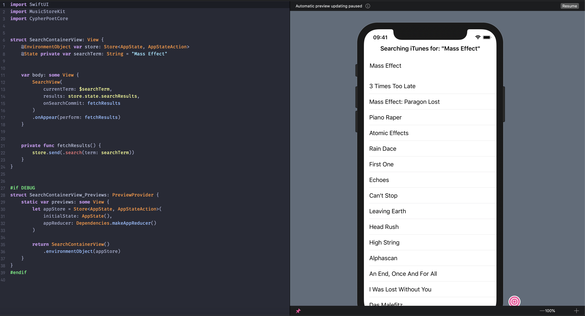
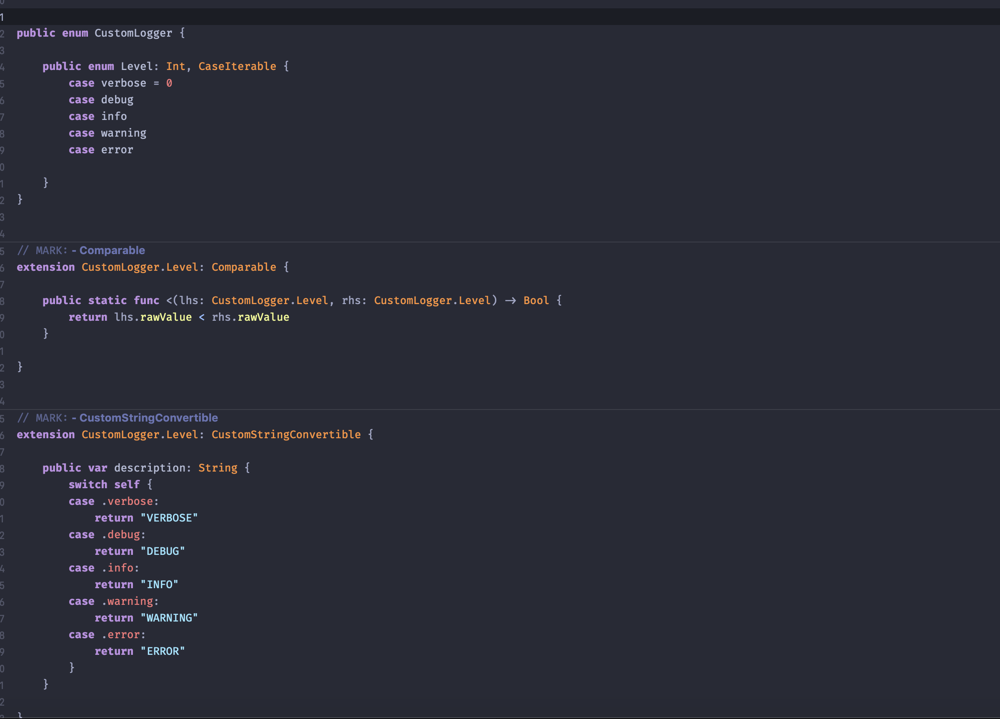
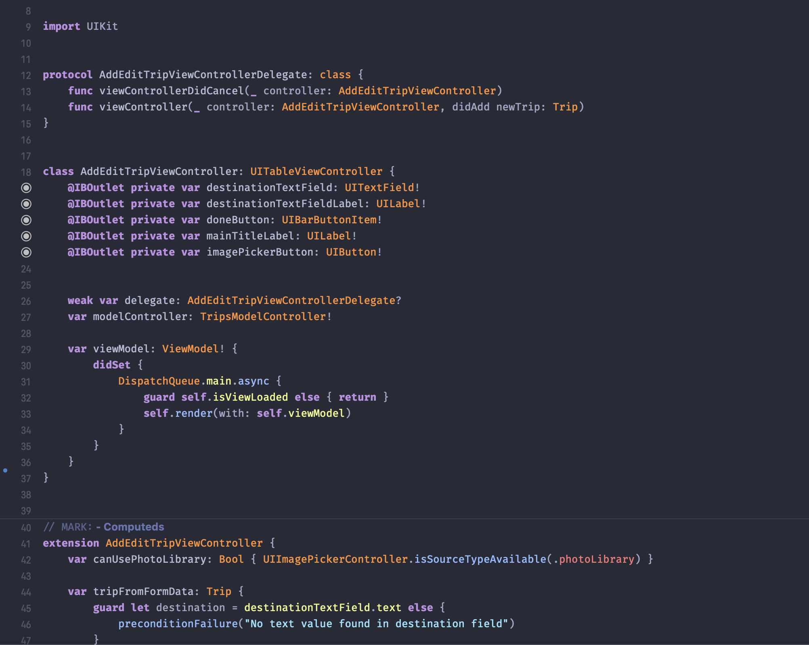
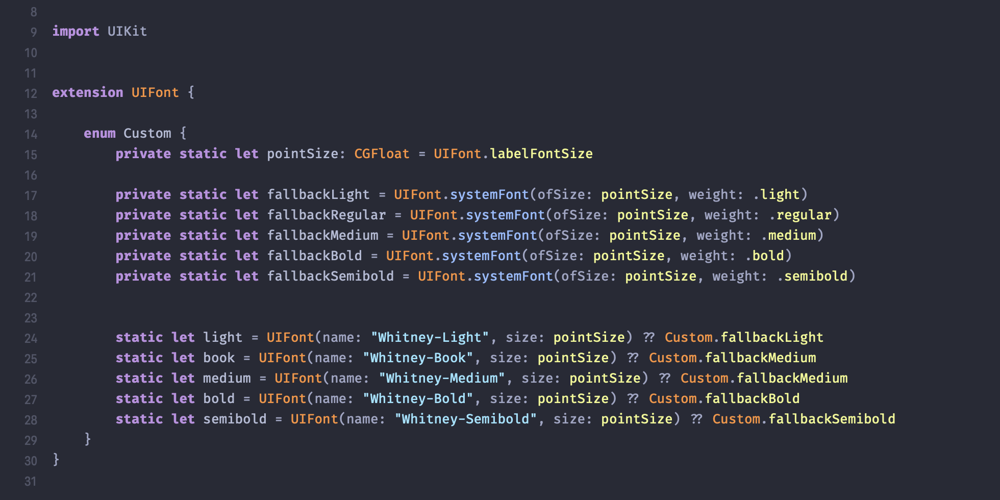

# Charmed Dark 🎨

_A charming and colorful dark theme for Xcode_ 🌈.

I love [Dark Mode](https://developer.apple.com/videos/play/wwdc2018/210/). And I love dark themes in general. But I've always found the _colors_ used by most dark themes to be downright ugly &mdash; stale, muddy, conflicting, and ultimately failing to take advantage of their darkened surroundings.

So the idea behind `Charmed Dark` is to create a palette of bright, charming, juicy primary colors that pop from a dark background, but still don't overwhelm and still play nicely with each other.

I hope you like it &mdash; but feel free to tweak as needed ✌️.

## 📸 Screenshots

- Open the files in [`/TestFiles`](./TestFiles) in Xcode to view things for yourself.
- Fonts used
  - [Fira Code](https://github.com/tonsky/FiraCode) for code
    - 13pt
    - Retina/Medium/Bold
    - Relaxed Line Spacing
  - SF Pro Text for Markup


<div style="text-align: center;">
  
  <br/>
  <br/>
  
  <br/>
  <br/>
    
  <br/>
  <br/>
    
  <br/>
  <br/>
</div>


## Installation

Simply download this project, then copy the [Charmed Dark.xccolortheme](./Charmed%20Dark.xccolortheme) file to:

```sh
~/Library/Developer/Xcode/UserData/FontAndColorThemes
```

If the folder doesn't exist, create it manually by prefacing the previous path with `mkdir`:

```sh
mkdir -p ~/Library/Developer/Xcode/UserData/FontAndColorThemes
```

Furthermore, if you currently have Xcode open, you'll likely need to restart it to see the theme show up in the `Preferences` menu's list of options.


## Credits

Despite the previous jab I made at dark theme colors, this theme _was_ inspired by some notable outliers &mdash; particularly [One Dark](https://github.com/bojan/xcode-one-dark) and the outstanding [Dracula](https://github.com/dracula/dracula-theme/blob/master/README.md) theme. I use Dracula as my [theme for iTerm](https://draculatheme.com/iterm/), and wouldn't hesitate to recommend it 🧛‍.

