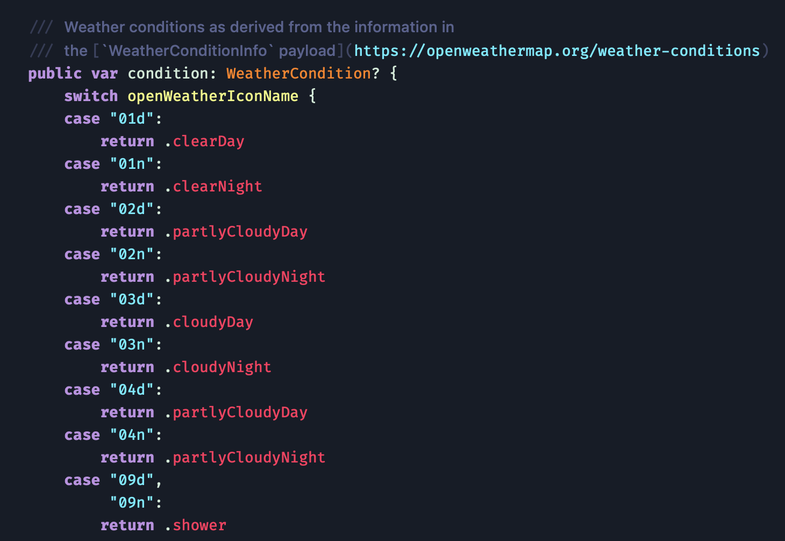
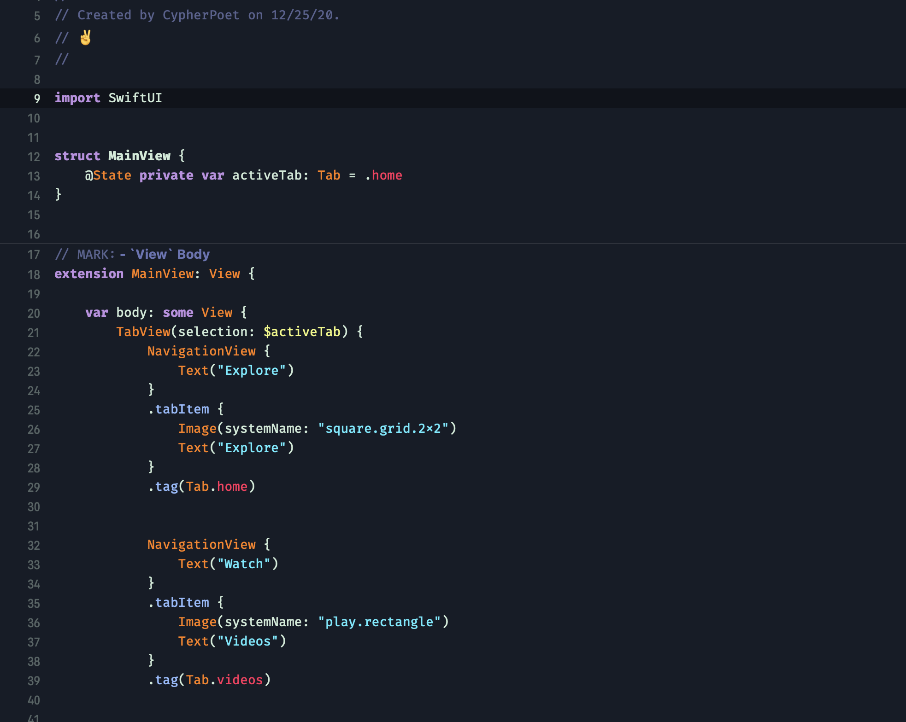
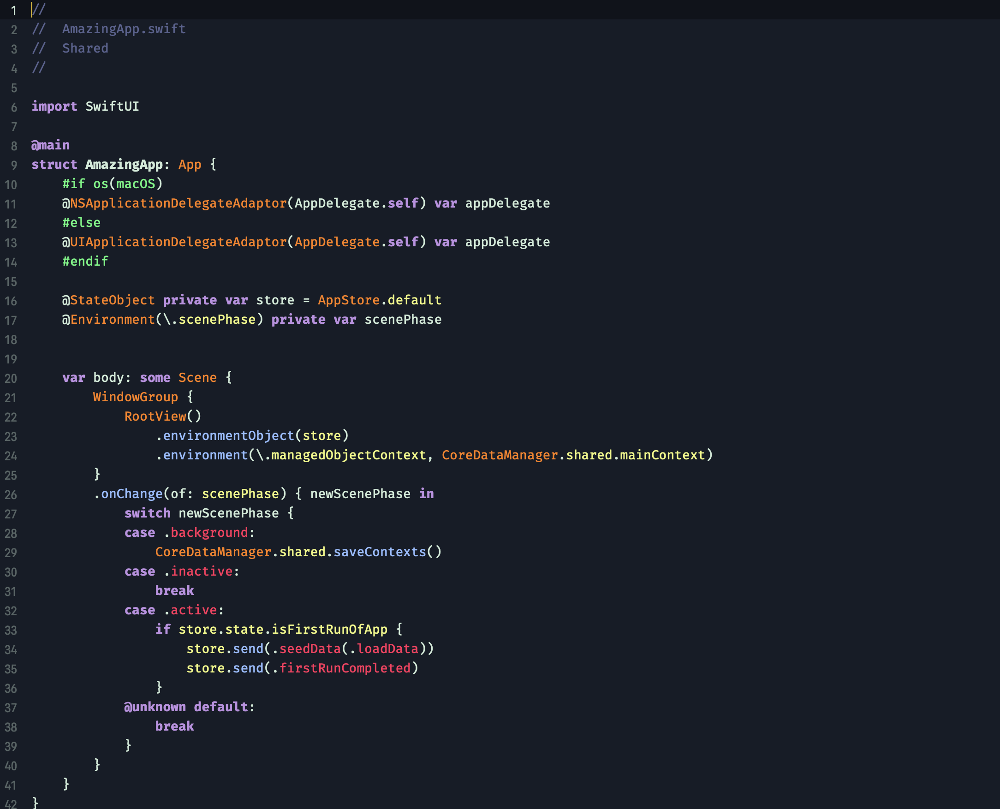
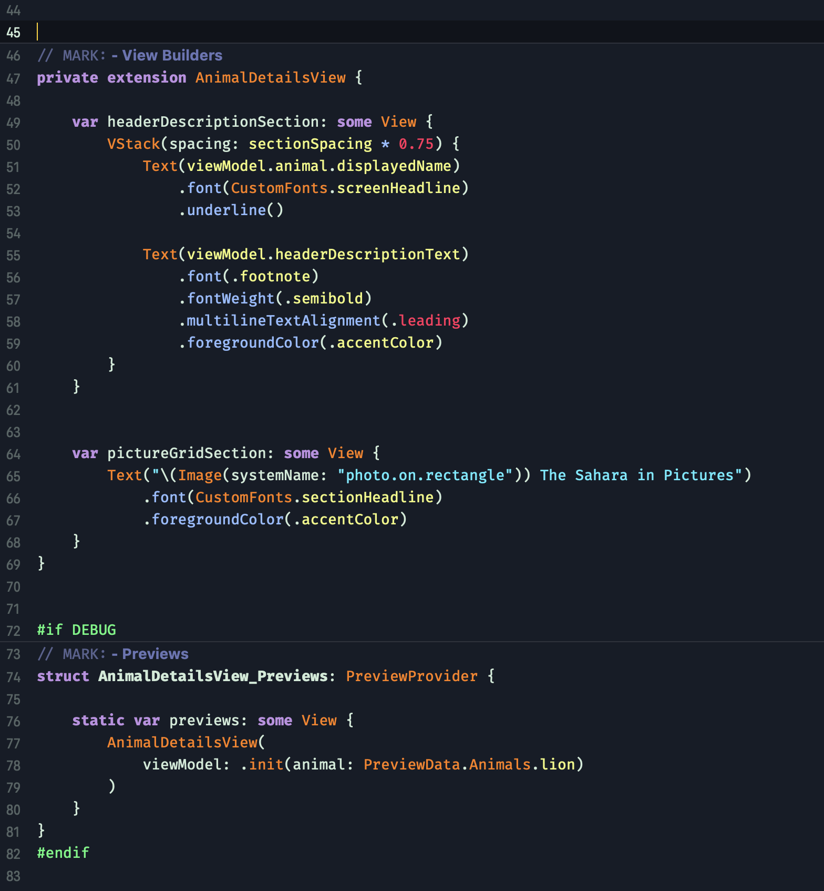
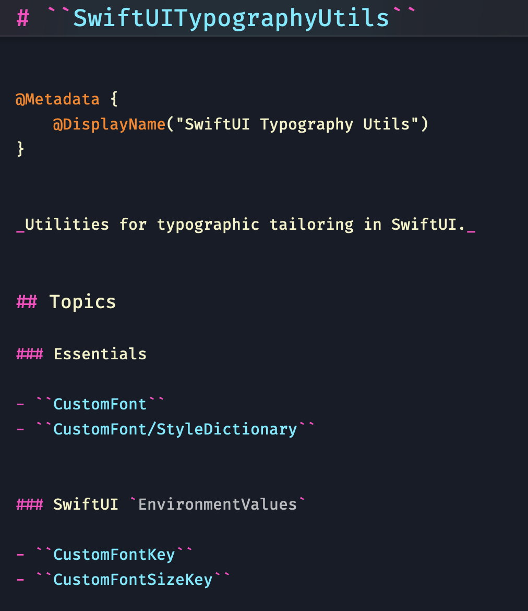

# Charmed Dark 🎨

_A charming and colorful dark theme for Xcode_ 🌈.

[I love](https://twitter.com/cypher_poet/status/1327703681341530113) [Dark Mode](https://developer.apple.com/videos/play/wwdc2018/210/). And code-editing themes are no exception. But I've always found the _colors_ used by most dark themes to be downright ugly &mdash; stale, muddy, conflicting, and ultimately failing to take advantage of their shadier surroundings.

So the idea behind `Charmed Dark` is to create a palette of bright, charming, juicy primary colors that pop from a dark background, please the eye, but still don't overwhelm and still play nicely with each other.

I hope you like it &mdash; but feel free to tweak things as needed ✌️.

## 📸 Screenshots

<details>
  <summary>Tip</summary>
  </br>

Depending on your monitor settings, GitHub's image resolution capabilities, and, likely, my own screen capturing limitations, these images might not be showing in their "true" resolution. Try following the [installation instructions](#Installation) below and booting up a new Xcode project so see things for yourself.

</details>

<div style="text-align: center;">
  
  <br/>

  <br/>
  
  <br/>

  <br/>
    
  <br/>

  <br/>
    
  <br/>

  <br/>
    
  <br/>

  <br/>
    
  <br/>

  <br/>
</div>

## ✍️ Typography

### Main Fonts Used

#### Source Code

- [Fira Code](https://github.com/tonsky/FiraCode)
  - 15 pt
  - Retina/Medium/Bold
  - Relaxed Line Spacing

#### Markup & Markdown

- SF Pro Text
- 15 pt
- Medium/Bold

#### Console & Debugger Text

- SF Mono
- Regular
- 13 pt

## ⬇️ Installation

If you haven't already done so, create a `FontAndColorThemes` directory inside of Xcode's `UserData` folder:

```sh
mkdir -p ~/Library/Developer/Xcode/UserData/FontAndColorThemes
```

Then simply download this project and copy the [Charmed Dark.xccolortheme](./Charmed%20Dark.xccolortheme) file to the `FontAndColorThemes` directory:

```sh
cp Charmed\ Dark.xccolortheme ~/Library/Developer/Xcode/UserData/FontAndColorThemes/
```

From there, open up Xcode and head into `Preferences` > `Themes`, and select `Charmed Dark` from the list of theme options. (If you currently have Xcode open, you'll likely need to restart it before seeing Charmed Dark appear in the menu).

## 🙏 Credits

Despite the previous jab I made at most dark themes, `Charmed Dark` _was_ inspired by some notable outliers &mdash; particularly [One Dark](https://github.com/bojan/xcode-one-dark) and the outstanding [Dracula](https://github.com/dracula/dracula-theme/blob/master/README.md) theme. I use Dracula as my [theme for iTerm](https://draculatheme.com/iterm/), and wouldn't hesitate to recommend it 🧛‍.
